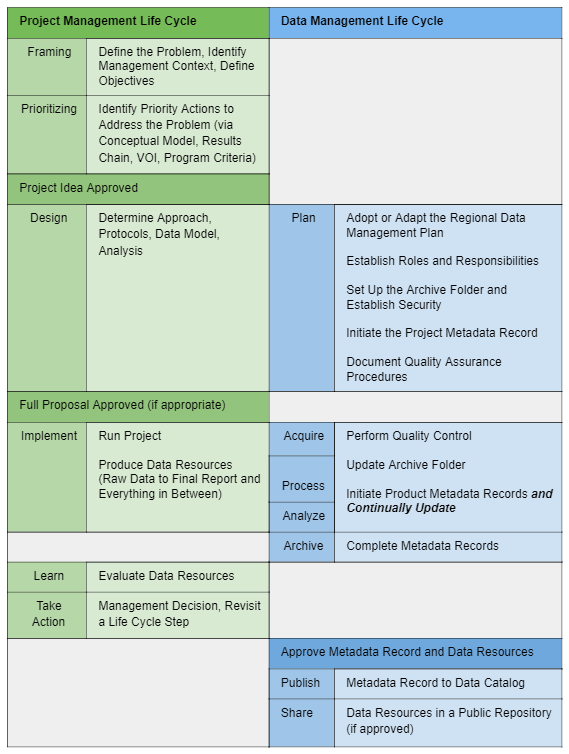

# Integrating Data Management with Project Management

 The table below, **Integrating Data Management with Project Management,** puts data management activities into the larger context of project management. Project management is the application of knowledge, skills, tools, and techniques to oversee a project to completion in the desired time and to a specified quality. Data management is concerned with the handling of data to ensure long-lasting integrity and usability. Data management is most effective when fully integrated into project workflows, project oversight, and staff supervision \(i.e., project management\). The purpose of this document is to provide knowledge and guidance for the data management aspect of projects. Project management itself is beyond the scope of this document.

